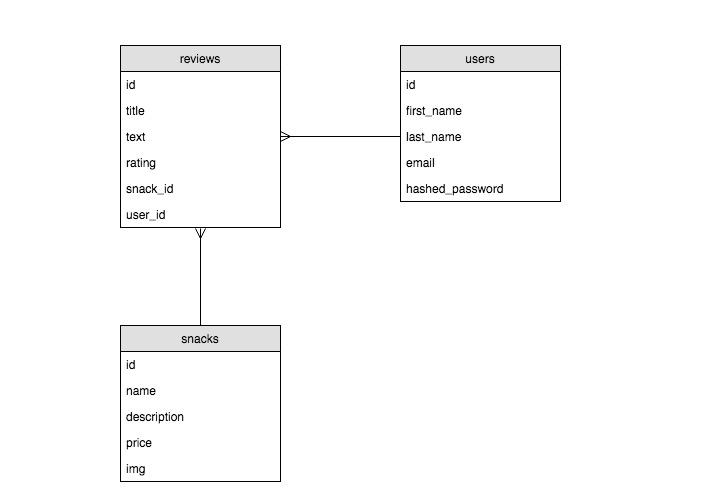

Your goal is to create a CRUD application to review and rate your favorite snacks at Galvanize! Draw on the topics you've learned from Q1 & Q2 to design and deploy an application that covers the desired user stories.

This repository is solely the backend of the project. You will need to build the frontend as well!

## User Stories

This repo includes some files to get you started, but it's up to you to finish these user stories:

- **User can view all snacks (already complete)**
  - When the user visits the homepage they see a list of all snacks


- **User can view details of an individual snack**
  - When the user clicks on a snack, display full information about that snack
  - Display list of reviews for snack
  - Display average rating of snack


- **User can signup a new account (registration)**
  - Display a form for the user to enter a name, email & password.
  - Clearly indicate registration success or failure to the user
  - The same email cannot be registered more than once


- **User can login with an existing account (authentication)**
  - Display a form for the user to enter an email & password.
  - Clearly indicate login success or failure to the user


- **User can post a review of a snack**
  - Display a form for the user to post a new review for a specific snack
  - If any information is missing when the user submits, surface an error
  - If everything is correct, bring them back to the snack's page to see their review
  - A visual clue should show the user which reviews are there own
  - Users may not post more than one review per snack

- **User can edit their own review of a snack**
  - Display a form for the user to edit a review for a specific snack
  - Pre-fill form with current review data
  - If any information is missing when the user submits, surface an error
  - User **cannot** edit other users reviews


- **User can delete their own review of a snack**
  - Provide option to delete a users own review for a specific snack
  - User **cannot** delete other users reviews


## Stretch

- **Unauthenticated users do not see forms and fields they cannot use**
  - Hide the review form if a user is not logged-in
  - Hide all buttons the user is not authorized to use

- **Admins can view a special admin dashboard for them**
  - Add `admin` column to users table
  - Update seeds to make a new user an admin
  - When a user logs in and they are an admin, bring them to this page
  - Users who are not admins are redirected to the home page


- **Admins can create, update, and remove snacks**
  - Admin can add new snacks through this admin page
  - Admin can remove existing snacks through this admin page
  - Admin can edit existing snacks through this admin page


- **Admins can remove users**
  - Admin can remove users through the admin page
  - When a user is removed, all their reviews are deleted
  - Admins **cannot** remove other admins (or themselves)


## Entity Relationship Diagram



**NOTE:** The migrations and seeds for the `snacks` table are included. You will need to implement the `users` and `reviews` tables yourself following this relationship diagram.

## Routes

| Request Method | Request URL | Request Body | Response Status | Response Body                                                  |
|----------------|-------------|--------------|-----------------|----------------------------------------------------------------|
| `POST`         | `/api/users`           | `{ "first_name": "Linus", "last_name": "Torvalds", "email": "linus.torvalds@hotmail.com", "password": "ilovelinux" }` | `200`           | `{ id: 2, "first_name": "Linus", "last_name": "Torvalds", ... } |


## Setup

Start by forking and cloning this repo.
Then install all dependencies

```shell
cd galvanize-snacks
npm install
```

Create the development database:

```shell
createdb snacks_dev
```

and run migrations and seeds:

```shell
npm run knex migrate:latest
npm run knex seed:run
```

Finally, start the server and check that you can GET the `/api/snacks` endpoint

```shell
npm run dev
```
